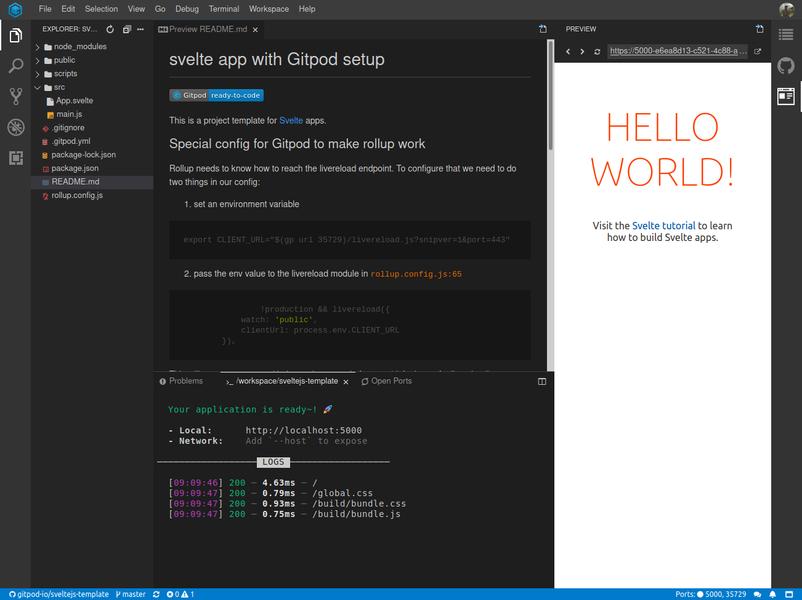

# Svelte in Gitpod

To work with Svelte in Gitpod, you will need to properly configure your repository. If you're using the official sveltejs [template](https://github.com/sveltejs/template) which uses Rollup then Here is how to do it:

## Create a `.gitpod.yml`

Start by creating a `.gitpod.yml` file in the root of your project and add the following to it:

```yml
tasks:
  - init: npm install
    command: npm run dev

ports:
  - port: 5000
    onOpen: open-preview
  - port: 35729
    onOpen: ignore
```

Now once you commit the file to the repo, start a new workspace you'll see that Gitpod will automatically install the dependencis and start the dev server and open the preview on the side for port `5000`.



## Making Live Reload work

In order to make live reload work we need to add a bit of configuration as specified below:

- Setup an environment variable called `CLIENT_URL` in the `.gitpod.yml` config file as shown below please make sure that you set it up before the task which starts the dev server(which is `npm run dev` in this case):

  ```bash
  - init: npm install
      command: |
        export CLIENT_URL="$(gp url 35729)/livereload.js?snipver=1&port=443"
        npm run dev
  ```

- Pass the value of `CLIENT_URL` environment variable to the `rollup-plugin-livereload` in `rollup-config.js` inside of the `plugins` array as shown:
  ```js
  plugins: [
    !production &&
      livereload({
        watch: 'public',
        clientUrl: process.env.CLIENT_URL
      })
  ]
  ```
  This will set `CLIENT_URL` to the workspace url of port `35729` (default port for livereload in Gitpod).

## VSCode Extensions

### Svelte for VS Code

Svelte for VS Code Provides syntax highlighting and rich intellisense for Svelte components in VS Code, utilising the [svelte language server](https://github.com/sveltejs/language-tools/tree/master/packages/language-server).

To add this extension to your repository add the following to your [.gitpod.yml](/docs/config-gitpod-file/)

```yml
vscode:
  extensions:
    - svelte.svelte-vscode@102.1.0:lalX6WJBrpvP8QKZTiLUmQ==
```

https://github.com/gitpod-io/sveltejs-template repo is a working example of the config described above <span aria-hidden="true">👆</span>.
